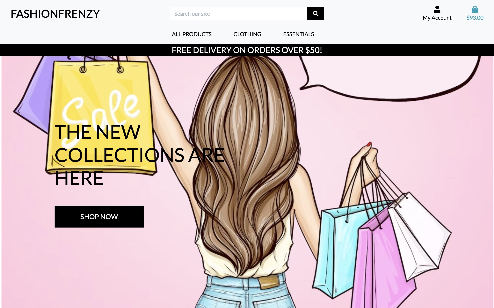
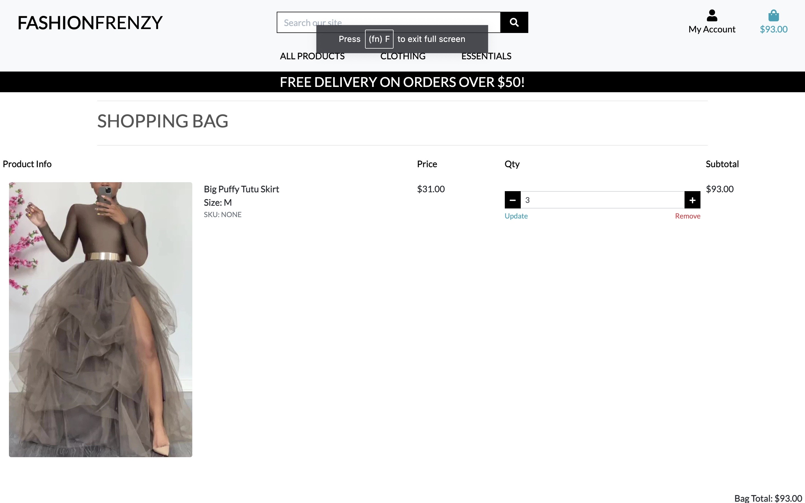
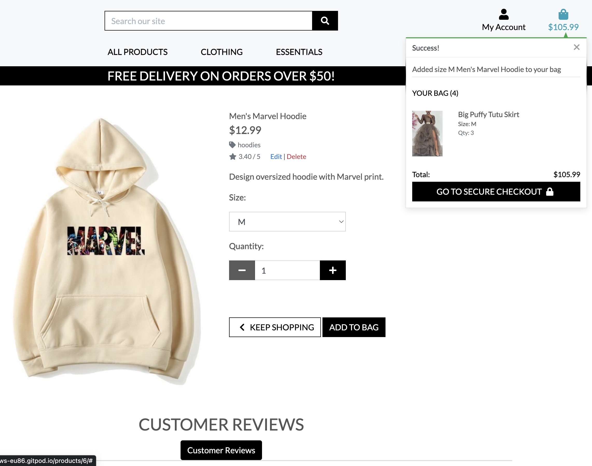
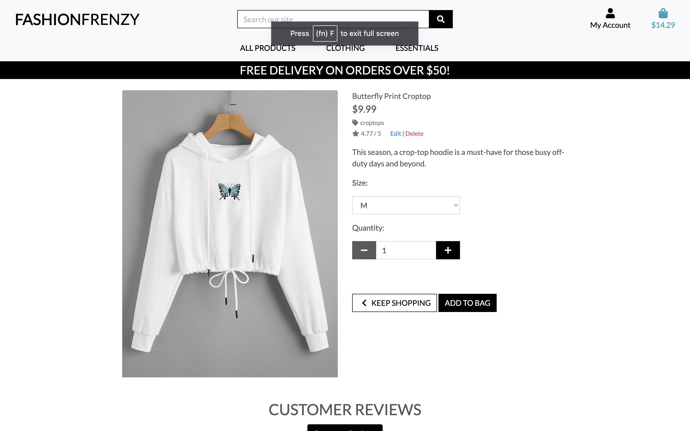
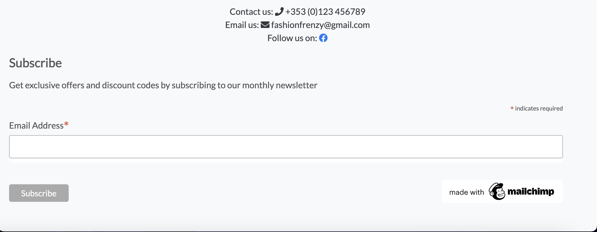
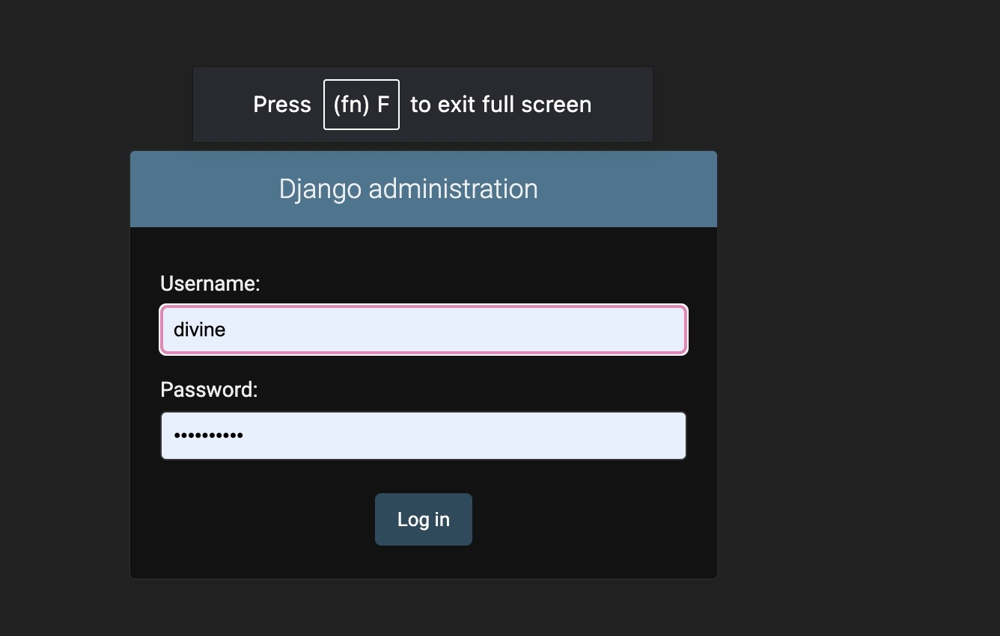

# Fashion Frenzy

## Description
This is a full-stack e-commerce project built using Django, Python, HTML, CSS, and JavaScript. This webiste is called Fashion Frenzy and its a website that sells clothes, shoes, handbags and other essentials for both male and female.

The website allows users to use a search and find the product and with just one click add to the shopping trolley. The website is intuitive with a simple design.

Check out the website [here](https://fashion-frenzy.herokuapp.com/)

## User Stories

 * Admin/ SuperUser

1. As a Site Owner I want to be able to add a product so that I can grow the number of options for users to purchase.
2. As a Site Owner I want to be able to Edit/Update a product so that I can change any product options such as price, descriptions etc.
3. As a Site Owner I want to be able to delete a product so that I can remove items that are no longer available.
4. As a Site Owner I want to be able to provide to customers with a subscription, notifying them of any deals, new items or upcoming promotions.
5. As a Site Owner, I want to be able to remove reviews from the site in case anything inappropriate was left.

* Shopper

1. As a Shopper I want to be able to view a range of products so that I can add them to my basket.
2. As a shopper I want to be able to click onto a product so that I can view a product description before adding it to my basket.
3. As a shopper I want my basket to keep a total of all my purchases so that I can keep track of what I am spending.
4. As a shopper I want to be able to adjust the number of products in my basket so that I can add multiple of the same item or remove some if necessary.
5. As a shopper I want to be able to pay online using debit or credit card so that I can check out quickly and easily.
6. As a shopper I want to be able to feel that the payment information I am providing are safe and secure so that I can complete my purchase without the risk of fraud.
7. As a shopper I want to be able to receive an order confirmation so that I can ensure there has been no errors with my order.
8. As a shopper I want to be able to order without having to create an account so that I can make quick and easy purchases.
9. As a shopper I want to be able to sort products by category so that I can find a range of products I’m interested in.
10. As a shopper I want to be able to filter my products so that I can find the best-priced product or the highest rated for examples.
11. As a shopper I want to be able to use a search bar to find a specific item so that I can quickly see whether the product is available.
12. As a shopper I want to be able to register for customer account so that I can store personal info and keep track of past orders.
13. As a shopper I want to be able to have the option to recover my password so that I can still access the account if I forget my login information.
14. As a shopper I want to be able to receive an email confirmation once my account has been set up so that I can confirm registration.
15. As a shopper I want to be able to sign up for a monthly newsletter so that I can keep up to date with new releases and upcoming promotions and deals.
16. As a shopper, I want to be able to contact the business owner so that I can ask any questions regarding products for sale, current orders, or specific requests.
17. As a shopper, I want to be able to leave a review for a previously purchased item on the site so I can give my feedback to the business owner and other potential buyers.

### User expectations 

* The website should have a simple user interface, with the navigation to each section clear

* The menu is intuitive and clear to read.

* The user can navigate easily through an interface.

* The website responsiveness is achieved on all devices.

* The user has a clear overview of all products/product groups.

* Before making a payment, the total purchase price is displayed, and product quantities can be removed/ adjusted.

* Website has a secure payment method, giving the user comfort feeling

# Features

## Home Page

## My Account

## Shopping Bag

* This page shows each product as a line item, displaying an image, name of the product, size, SKU, price per item, the quantity selected, quantity selector to update and a subtotal for each item.

* When the quantity selector is at 1, the minus button is disabled, user can use the button underneath (remove) to remove item from the basket.

* Basket would show the pricing summary of all items within, delivery fee and total.

* If the user has not met the free delivery threshold, then an alert message is shown, prompting the user that they can qualify for free delivery if they spend more.

## Account Registration

 Registered user would need to enter the email address and password that they used when signing up to the site.

* The user can only log in once they have activated their account via an email received after signing up.

* A message to prompt the user that if an account has not been created, they can click the signup hyperlink to be redirected to the signup page.

* If the user enters in the wrong credentials, an error message is displayed to the user.

* Once the user has successfully logged in, they will be redirected to the home page. A success message will show to confirm the login has been successful.

## Sign In

## Order Added Successfully

## Order Confirmation

## Sign Out

* When clicking logout from the navigation bar, the user is redirected to a sign-out page to confirm their action.

## Products Page

## Products Details

## Add Review

## Checkout

* A checkout form, prompts the user to enter their delivery details with Stripe integration.

* User has ability to save their details for next time, this is enabled by having a checkbox, which user can confirm. This would save the delivery detail and not the card details.

* Before continuing with checkout process, order summary will be displayed for user to validate the total purchase summary and see all items.

* A message is shown just below the complete order button to warn the user that they will be charged a certain amount on their card.

## Footer

## Admin Login

## Admin Panel

## Sort by product options

# Existing Features

* Responsive design

* Navigation Menu

* Postgress databases to store information and user login/profile information

* CRUD Functionality

* Filter list details functionality

* Login functionality

* Logout functionality

* Register functionality

* Customer review functionality

## Databases

* Category

The Category model is used to create categories for products to be assigned to. This model will be the primary source for filtering a searching through products, whether that be product type or deals etc

* Products

The Product model will be used to add items to the site for sale. Through this model the site owner or admin user will be able to add, update or delete a chosen product. It will also display all products on the site including a product details page.

* User Profile

The User Profile model allows customers to store delivery information allowing for an easier checkout process.

* Reviews

The Review model allows any user to submit a review on a purchase they have made, whether they or registered or not. As all users can make a purchase all users can also leave a review. Users can access this function through the product details page.

* Orders

The Order model will process an order made by the customer, this connects with the Order Line Items model to complete the customers purchase.

# Facebook Page

* Facebook Fashion Frenzy page

# Features To be Implemented

* I would have liked to have more products other than just the ones I have on the website.
* I would have also loved to have shoe sizes for the shoes on this website.

# Technologies Used

## Coding Languages

* HTML
* CSS
* Python
* JavaScript

# Other Technologies Used

* Django - Framework used to build the site and admin page.
* HerokuSQL - Database used in the project.
* Python OS. - Used for os.environ to help with automated development DEBUG
* Bootstrap - Used for styling the site a framework addition to CSS3.
* Stripe - Handling Payments
* Font Awesome - Used for icons and their animations
* Django Allauth - Used to handle user authentication

# Hosting Technologies

* Heroku - Deployment and hosting environment.
* AWS. - Storing images and static files.
* GitHub - Hosting Repository code

## Testing 

* The HTML templates were validated using W3 Validator. No major errors were returned for the HTML segments.
* The CSS style sheet was validated using W3C Validator and no errors were returned.
* The JavaScript files were run through JSHint and no errors were found
* The python code was validated using PEP8. No errors were returned.

# Responsive Testing

The sites responsiveness has been tested on a number of platforms and smaller devise including:

* iPhone 13
* iPhone XR
* One Plus One
* Samsung S20
* MacBook Air

# Deployment

This project was deployed using Heroku. 

See the following steps to deploy below:

* Create a New App with Heroku.

* Create a unique name and select a region closest to you.

* Click on 'Create App'. This will take you to a page where you can deploy your project.

* Next, click on the 'Resources' tab and search for 'Heroku Postgres' in the Add-ons section to add the Heroku Postgres database to the project.

* Click on the 'Settings' tab at the top of the page. The following steps must be completed before deployment.

* Within the settings.py file you need to import os and import dj_database_url at the top. Then, in the command line install dj_database_url and psycopg2 so that we can use Postgres. Freeze these installs into the requirements.txt file.

* Scroll down to Config Vars (also known as Environment Variables) and click 'Reveal Config Vars'. Here the database URL is stored to run my app on Heroku. I used an if statement in settings.py (see below) so that when our app is running in Heroku, we connect to Postgres but in our local environment, we connect to sequel light: Development is set in gitpod's environment variables as True.

* Next I ran the migrations again to set up my Postgres Database by running Python 3 manage.py migrate within the command line and then create a Superuser using python3 manage.py create superuser.

* We must then install Gunicorn, which will act as our webserver and freeze that into our requirements file.

* Next I created a Procfile to tell Heroku to create a web dyno that will run Gunicorn and serve our Django app.

* I then told Heroku temporarily disable collectstatic by using the Heroku config set, disable collectstatic = 1. I added this via Heroku's Config Vars but this can also be added via the command line. This was to prevent Heroku from attempting to deploy the static files, causing an error, until Amazon Web Services was set up.

* Then add the hostname of our Heroku app to 'Allowed Hosts' in settings.py as well as localhost so that GitPod will still work too.

* I then committed and pushed these changes into my GitHub repository so that I could start my first deployment. Once complete, log into Heroku using the following command in the terminal, heroku login -i, and enter your login details.

* Once logged in, add a remote to your local repository with the Heroku git:remote command and your Heroku app’s name.

* Finally, deploy using the following command: git push heroku main. Once deployed you can open the app from the command line to ensure it was successfully deployed.

* Once we can confirm the app deployed successfully, we need to set up Amazon Web Services as this will be where my media and static files are stored.

* Click into it and then click the orange 'Create a Bucket' button. I named this bucked to match my Heroku app name to keep things simple. Then, I selected my region and changed the 'Object Ownership' setting to ACLs enabled. Then, I unchecked block all public access, acknowledged that the bucket will be public, and clicked on the 'Create Bucket' button.

* Next, on the properties tab, I scrolled to the bottom and turned on static website hosting. This gave me a new endpoint that I can use to access it from the internet. For the index and error document, I filled in some default values and then clicked Save.

* Now on the permissions tab I pasted in the following coors configuration:

* Within AWS I created a group and a user to access the bucket by searching for the service IAM (Identify and Access Management). I clicked on 'User Groups' and then 'Create User Group' giving it the name 'manage-clay-and-fire'.

* I then created the Policy used to access our bucket by clicking 'Policies' and then 'Create Policy'. I clicked onto the JSON tab and then selected import managed policy to import one that AWS has pre-built for full access to s3.

* I searched for s3 and then import the s3 full access policy. I then got the bucket ARN from the bucket policy page in s3 and pasted that into the 'Resource' section on the JSON tab.

* I then clicked the 'Next' buttons until I reached 'Review Policy'. I gave it a name and a description and then clicked 'Create Policy'. This took me back to the policies page.

* Next I attached the policy to the Group I created by returning to the Create User Group page and refreshing the Policies box. I then was able to attach the new policy created by selecting it and finally clicking 'Create Group'.

* Finally I created a user to put in the group by going to the User's page and clicking 'Add User'.

* I then downloaded the CSV file which contained this User's Access Key and Secret Access Key which I used to authenticate them from my Django app. It is important to download this file as you cannot be re-downloaded and contains the new user's credentials which I next add to the Config Vars on Heroku.

* Next, I connected Django to the new S3 bucket. To do this I installed two new packages:

* boto3

* django-storages

* I then pip3 freeze these to the requirements.txt file to ensure they're installed on the next Heroku Deploy and added storages to our installed apps in settings.py.

* I update my setting.py and then added the following to our Config Vars on Heroku:

* USE_AWS = True
* AWS_ACCESS_KEY_ID, taken from the new user credentials
* AWS_SECRET_ACCESS_KEY, taken from the new user credentials
and removed:

* Remove staticcollect=1 from congifvars within Heroku.

* I also set DEBUG to 'DEVELOPMENT' in os.environ as for security it cannot be set to True on the deployed version.

* The next step is to tell Django that in production we want to use s3 to store our static files whenever someone runs collectstatic and that we want any uploaded product images to go there also. To do that I created a file called custom_storages.py.

* Within this file I imported both our settings from django.conf and the s3boto3 storage class from Django Storages. Then I created custom classes for static storage and media storage which inherited the imported class from Django Storages to give it all its functionality. Then I set the class to store static and media files in the location specified in the USE_AWS if statement within settings.py.

* Finally, to complete the deployment of the AWS setup, I committed the changes and pushed them to GitHub. In the command line I then typed the following command: git push heroku main.

# Content

* I used the Code Institutes Boutique Ado Follow Along project to help with building this project along with the following websites:

* Codemy.com and Code Institute blog app was used to help create the review form and database

* XML Sitemap Generator was used this to generate the sitemap for my project.

# Styling

* Font Awesome Icons
* Bootstrap
* Products images were taken from google and Pinterest.

# Acknowledgments

Thank you to everyone who supported and encouraged me throughout this project. Thank you to tutor support for always helping me when I was stuck. Thank you to Student support for giving me extra time to complete this project.
